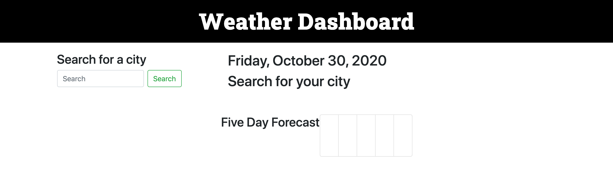
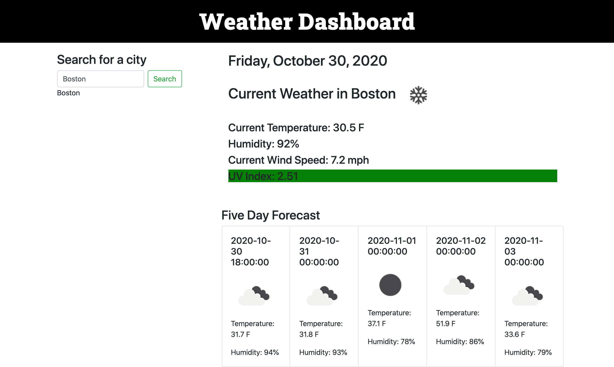
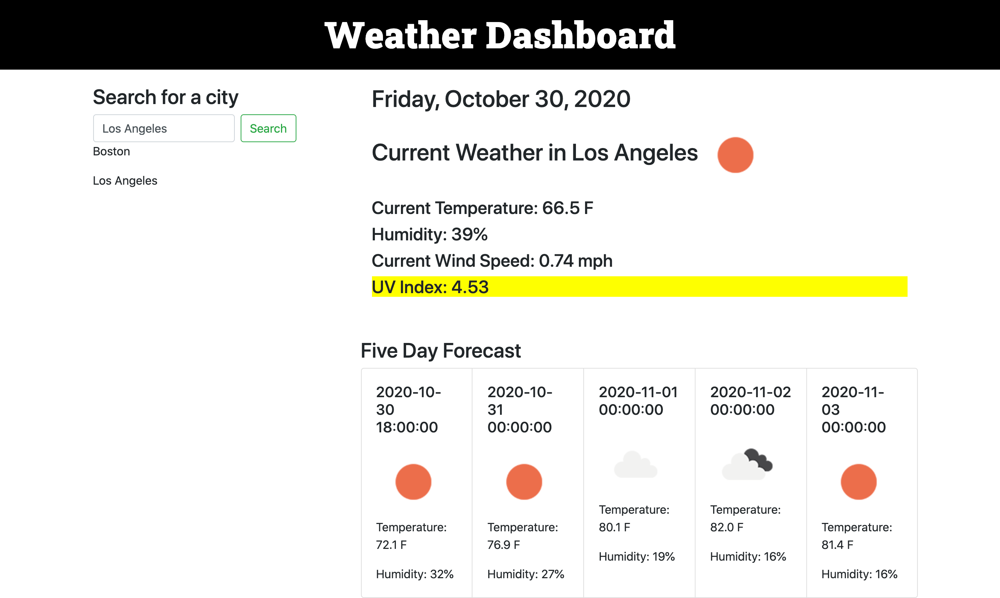

# Weather-Dashboard
This project was to create a weather application using the Open Weather Map API. The user is able to search for a city and is presented with current weather data for the city as well as a five day forecast. The user's search history should be available using local storage.

I started by creating HTML elements within the bootstrap framework. I knew where on the page I wanted the data from the API to appear and gave the elements descriptive ids so I would understand which data was supposed to appear there. 

Most of the code appears in the event click listener applied to the search button. The first function prevents the search button from refreshing the page (its default behavior). I decided to start with the local storage piece and append the search city underneath the search button. 

Next is the first AJAX request from open weather map to get the current weather data for the city that the user searches for. I pulled the temperature, humidity, and wind speed data from the API response and displayed it on the page. I also pulled the code for the current weather icon and displayed that on the page as well. 

I had to perform a second AJAX request from open weather map to get the UV index data for the city that the user searches for. The latitude and longitude of the city that the user searches for are stored in variables and then used in the URL for the AJAX request. The API response returns the UV index value, and then I created an if statement related to that value so that if the UV index is favorable, the background color is green. If it is moderate, the background color is yellow, and if it's severe, the background color is red. 

The third AJAX request is for a five day forecast data. This response was a little more complicated because it returned and array of 40 items. The response returned weather data for every three hours, so I had to go through the array and pick the indexes that I wanted. I used bootstrap cards to display this data, the date, an icon, the temperature and humidity. 

Overall I think I was pretty successful with this. I am still working on a few CSS things and still getting the hang of local storage. But this functions the way I expect it to, which is a big deal!

Deployed URL: https://shannonquinn91.github.io/Weather-Dashboard/ 

